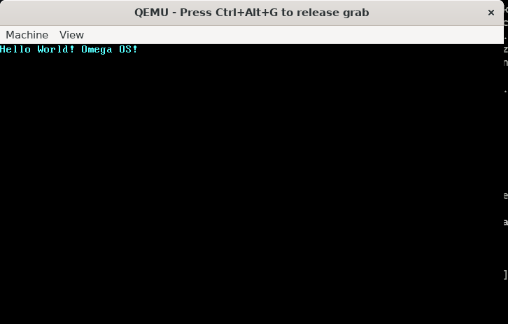

# Omega OS in Rust 

To build the repo by default with all required configs required, copy `./config/config.toml` to `~/.cargo/`. 

**Note:** Install all required crates before copying the config.toml file Make changes as required. 

